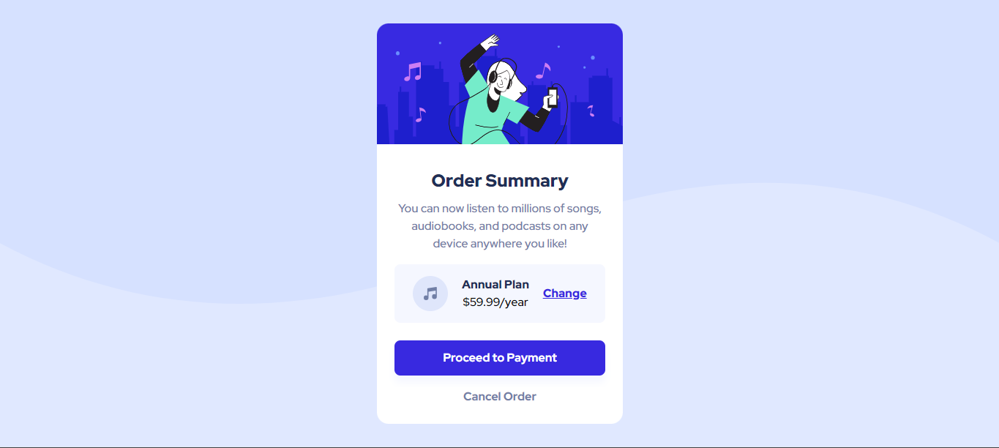

# Frontend Mentor - Order summary card solution

This is a solution to the [Order summary card challenge on Frontend Mentor](https://www.frontendmentor.io/challenges/order-summary-component-QlPmajDUj). Frontend Mentor challenges help you improve your coding skills by building realistic projects.

## Table of contents

- [Overview](#overview)
  - [The challenge](#the-challenge)
  - [Screenshot](#screenshot)
  - [Links](#links)
- [My process](#my-process)
  - [Built with](#built-with)
  - [What I learned](#what-i-learned)
  - [Useful resources](#useful-resources)
- [Author](#author)

## Overview

### The challenge

Users should be able to:

- See hover states for interactive elements

### Screenshot



### Links

- Solution URL: [Github Repo](https://github.com/samoina/order-summary-component)
- Live Site URL: [Netlify Link](https://samoina-order-summary-component.netlify.app/)

## My process

### Built with

- Semantic HTML5 markup
- CSS custom properties
- Flexbox
- Mobile-first workflow

### What I learned

I took some time to look at the `background` CSS Property as 1 was wondering how to incorporate both the mobile & desktop patterns provided in the images folder.

I used `background-size: contain` so that the image does not stretch or get cropped, and then set `background-repeat: no-repeat` to avoid tiling. This way, the spaces not covered by a background image are filled with the background-color property which I provided to give the desired outcome.

```css
body {
	background-color: var(--pale-blue);
	background-image: url(./images/pattern-background-mobile.svg);
	background-size: contain;
	background-position: top;
	background-repeat: no-repeat;
}
```

### Useful resources

- [Mozilla Docs on background in CSS](https://developer.mozilla.org/en-US/docs/Web/CSS/background) - This helped me to better understand the `background` property in CSS.

## Author

- Website - [Samoina Lives](https://samoinalives.wordpress.com/)
- Frontend Mentor - [Samoina](https://www.frontendmentor.io/profile/samoina)
- Twitter - [Samoina](https://www.twitter.com/samoina)
